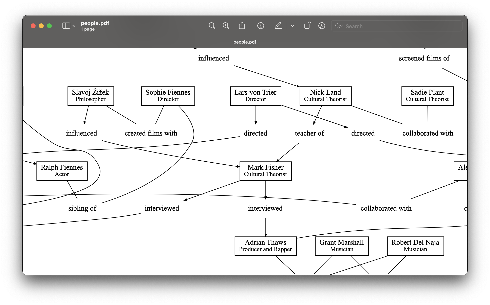

<div align="center"></div>
<h4 align="center">people - relationship graphs for everyone else</h4>

---

To install, run `go build && sudo mv people /usr/local/bin`. You need to have `graphviz` installed, which on macOS can be installed using `brew install graphviz`.

```
add, a   Add a user to the database. Format is ID FULL_NAME SUBTITLE. If FULL_NAME is -, interpreted from id
draw     Outputs the chart. Format is FILETYPE (default pdf)
edit     Edit a user. Format is CURRENT_ID NEW_ID FULL_NAME SUBTITLE
join     Join people together. Format is COMMA_SEPARATED_IDS LABEL (">" or "-") COMMA_SEPARATED_IDS
help, h  Shows a list of commands or help for one command
```

NB: The code is currently not very efficient — it’s been confirmed to work, and that’s pretty much it. You may run into problems with an extremely large database of people.
